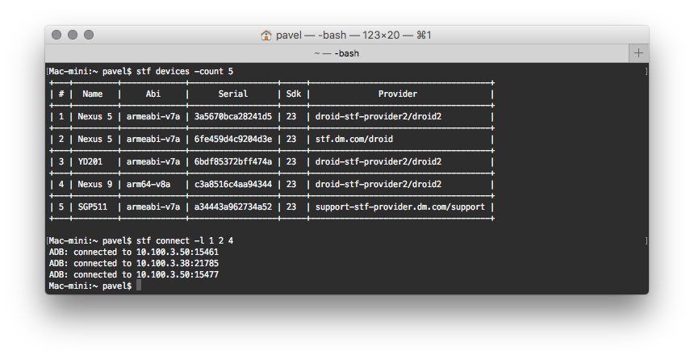

# STF console client
A console client for the [Smartphone Test Farm](https://github.com/openstf/stf) service

## Download
[Latest version](https://github.com/e13mort/stf-console-client/releases/latest)

[All versions](https://github.com/e13mort/stf-console-client/releases/)

## Configuration

* Download and extract an artifact from "releases" page into some target directory
* Create file "farm.properties" either in your home directory or in the target app directory
* Add following properties into the file:

        stf.url=<your_farm_url>/api/v1/
        stf.key=<token created in 'Settings/Keys/Access Tokens' seciton>
        stf.timeout=<farm connection timeout in seconds, eg. 60>
        android_sdk=<path to android sdk directory>
* Optionally, add the app's directory into your PATH environment var

## Usage
stf [command] [command options]

  Commands:

    disconnect      Disconnect from all of currently connected devices
      Usage: disconnect

    devices      Print list of available devices
      Usage: devices [options]
        Options:
          --all
            Show all devices. By default only available devices are returned.
            Default: false
          --my-columns
            <BETA> Use columns from web panel
            Default: false
          -abi
            Filter by device abi architecture
          -api
            Filter by device api level
            Default: 0
          -count
            Filter devices by count
            Default: 0
          -maxApi
            Filter by device max api level
            Default: 0
          -minApi
            Filter by device min api level
            Default: 0
          -name
            Filter devices by its name
          -provider
            Filter devices by provider
          -serial
            Filter devices by serial number

    connect      Connect to devices
      Usage: connect [options]
        Options:
          --all
            Show all devices. By default only available devices are returned.
            Default: false
          --my
            Connect to currently taken devices
            Default: false
          -abi
            Filter by device abi architecture
          -api
            Filter by device api level
            Default: 0
          -count
            Filter devices by count
            Default: 0
          -f
            Read connection params from a file
          -l
            Connect to devices by its indexes from the results of previous
            "devices" command. E.g. "-l 1 2 5"
            Default: []
          -maxApi
            Filter by device max api level
            Default: 0
          -minApi
            Filter by device min api level
            Default: 0
          -name
            Filter devices by its name
          -provider
            Filter devices by provider
          -serial
            Filter devices by serial number
          -u
            Read connection params from an url

#### Store connection parameters in a file
Connection parameters might be stored as a separate file:

    confing.json:
    {
      "count": 2,
      "api": 23,
      "names": "nexus5,nexus6",
      "minApi": 21,
      "providers": "~support,autotests",
      "serials": "3a4674bce45644",
      "maxApi": 26,
      "abi": "arm"
    }

    usage: stf connect -f config.json
           stf connect -u http://sample.com/params.json

All fields are optional. For the "providers", "serials" and "names" fields the `~` sign might be used to inverse filter.
E.g config with parameter

    "providers": "~support,autotests"

means 'use all available devices except the ones which belongs to the "support" and "autotests" groups'.